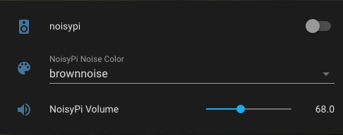

# noisyPi
Raspberry Pi noise generator integration with Home Assistant using MQTT.


[](https://github.com/marazmarci/noisyPi/stargazers)

---
# Requirements
+ Raspberry Pi
  + Speaker (connected to Raspberry Pi)
  + Python3 >= v3.7.3 (https://www.python.org/)
  + SoX - Sound eXchange (http://sox.sourceforge.net/)
  + paho-mqtt >= v1.5.1 (https://pypi.org/project/paho-mqtt/)
  + run `/home/pi/noisyPi/noisyPi.py` as a systemd service (started on boot)
+ Home Assistant (https://www.home-assistant.io/)
  + MQTT Broker (Mosquitto)
  + MQTT account (to authenticate with NoisyPi)
  + NoisyPi entities in `configuration.yaml` file
    + `switch.noisypi` - turn on/off
    + `number.noisypi_volume` - set volume
    + `input_select.noisypi_noise_color` - select noise color [whitenoise, pinknoise, brownnoise]
  + Automations
    + Noise color publish & subscribe MQTT

---
# Installation

Note: This guide shows the usage of the `nano` command line text editor, when needing to edit files, but you can use any other editor (eg. `vi`).

## Steps


1. [Install Python3](https://github.com/marazmarci/noisyPi#1--install-python3)
2. [Install SoX - Sound eXchange](https://github.com/marazmarci/noisyPi#2-install-sox---sound-exchange)
3. [Install paho-mqtt](https://github.com/marazmarci/noisyPi#3-install-paho-mqtt)
4. [Clone the noisyPi repository](https://github.com/marazmarci/noisyPi#4-clone-the-noisypi-repository)
5. [Edit the MQTT credentials in config.py](https://github.com/marazmarci/noisyPi#5-edit-the-mqtt-credentials-in-configpy)
6. [Add noisyPi as a systemd service](https://github.com/marazmarci/noisyPi#6-add-noisypi-as-a-systemd-service)
7. [Setup Home Assistant](https://github.com/marazmarci/noisyPi#7-setup-home-assistant)
8. [Add noisyPi card to Home Assistant](https://github.com/marazmarci/noisyPi#8-add-noisypi-card-to-home-assistant)

## 1.  Install Python3
On the Raspberry Pi:
```sh
sudo apt update
sudo apt install python3
```

## 2. Install SoX - Sound eXchange

```sh
apt-get install sox
```

## 3. Install paho-mqtt

```sh
pip install paho-mqtt
```

## 4. Clone the noisyPi repository

```sh
cd /home/pi
git clone https://github.com/marazmarci/noisyPi.git
```

## 5. Edit the MQTT credentials in config.py

```sh
cd noisyPi
nano /etc/systemd/system/noisypi.service
```

**CTRL+X** to exit, then **Y** to save, and **Enter** to confirm.

## 6. Add noisyPi as a systemd service

Create `/etc/systemd/system/noisypi.service`:

```sh
sudo nano /etc/systemd/system/noisypi.service
```

Paste this in the editor:

```sh
[Unit]
Description=noisyPi
StartLimitIntervalSec=0

[Service]
User=pi
ExecStart=python3 /home/pi/noisyPi/noisyPi.py
Restart=always
RestartSec=15s

[Install]
WantedBy=multi-user.target
```

**CTRL+X** to exit, then **Y** to save, and **Enter** to confirm.

Run these commands after saving the file:

```
sudo systemctl daemon-reload
sudo systemctl enable noisypi.service
sudo service noisypi start
sudo service noisypi status
```

Whenever your Pi restarts, the noisyPi service will be started automatically.

And if the Python script crashes/stops for some reason (eg. MQTT disconnects), the service will be restarted automatically with a 15 seconds delay.

## 7. Setup Home Assistant
Add the following lines to Home Assistant's `configuration.yaml` file:

```yaml
mqtt:
  switch:
    - name: noisyPi
      icon: mdi:speaker
      state_topic: "noisypi/state"
      command_topic: "noisypi/state/command"
      availability_topic: "noisypi/availability"
      payload_on: on
      payload_off: off
      state_on: on
      state_off: off
      qos: 1
  number:
    - name: NoisyPi volume
      icon: mdi:volume-high
      state_topic: "noisypi/volume"
      command_topic: "noisypi/volume/command"
      availability_topic: "noisypi/availability"
      min: 50
      max: 100
      step: 1
      qos: 1


input_select:
  noisypi_noise_color:
    name: NoisyPi Noise Color
    options:
      - whitenoise
      - pinknoise
      - brownnoise
    initial: brownnoise
    icon: mdi:palette
```
Open **Configuration > Automations** and add the following 2 new automations:

`NoisyPi Color (pub)`:
```yaml
alias: NoisyPi Color (pub)
description: NoisyPi Color Selection Changed
trigger:
  - platform: state
    entity_id: input_select.noisypi_noise_color
condition: []
action:
  - service: mqtt.publish
    data:
      topic: cmnd/noisypi/COLOR
      retain: true
      qos: 1
      payload: '{{ states(''input_select.noisypi_noise_color'') }}'
mode: single
```

<br>

`NoisyPi Color (sub)`:
```yaml
alias: NoisyPi Color (sub)
description: Set NoisyPi Color Value
trigger:
  - platform: mqtt
    topic: stat/noisypi/COLOR
condition: []
action:
  - service: input_select.set_value
    target:
      entity_id: input_select.noisypi_color
    data:
      value: '{{ trigger.payload }}'
mode: single
```


## 8. Add noisyPi Card to Home Assistant
Add these entities to your preferred dashboard:


